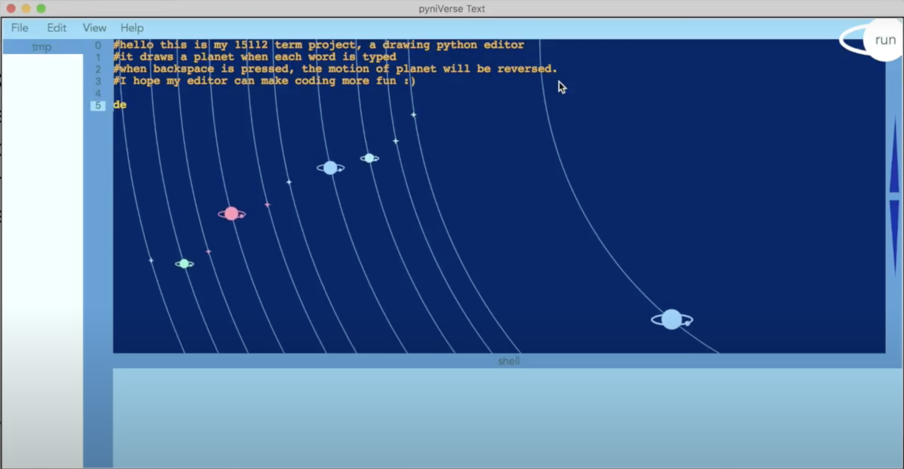

# PyniverseText
This is my term project for 15-112 at CMU. It is a drawing python text editor with multiple features including auto-indenting, multi-line commenting and indenting, and also its own little interpreter.

